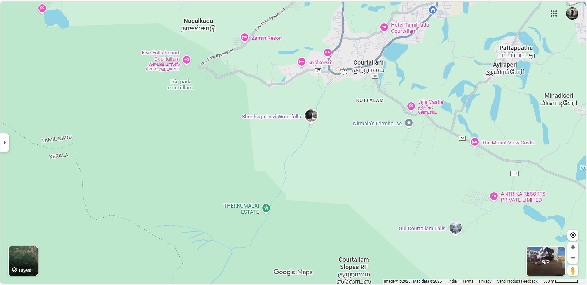
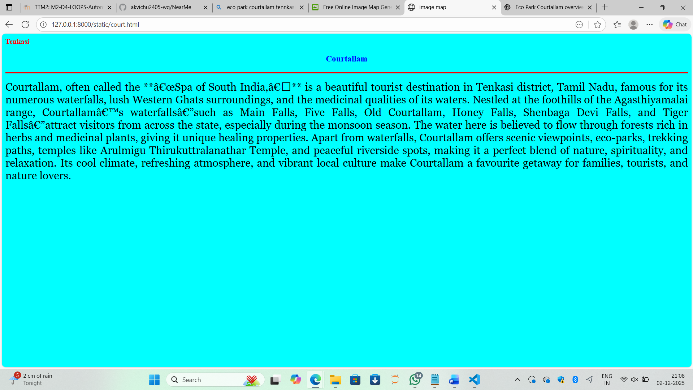
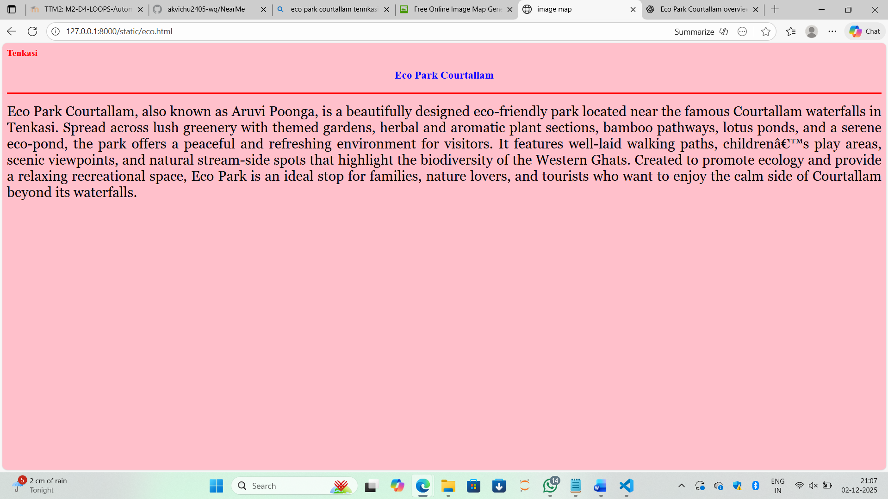
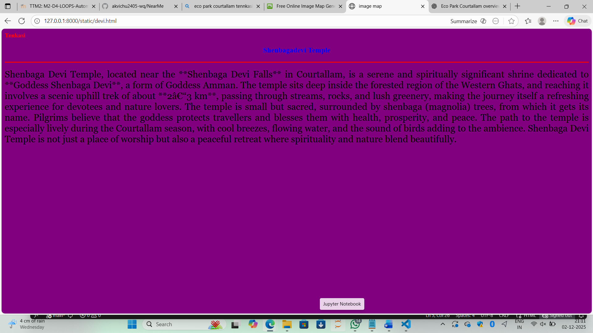

# Ex03 Places Around Me
## Date: 02/12/2025

## AIM
To develop a website to display details about the places around my house.

## DESIGN STEPS

### STEP 1
Create a Django admin interface.

### STEP 2
Download your city map from Google as an image.

### STEP 3
Insert the image using `````` tag and link it to the map.

### STEP 4
Using ```<map>``` tag name the map.

### STEP 5
Create clickable regions in the image using ```<area>``` tag.

### STEP 6
Write HTML programs for all the regions identified.

### STEP 7
Execute the programs and publish them.

## CODE
```
map.html

<html>
    <head>
        <title>My City</title>
    </head>
    <body>
        <h1 align="center">
            <font color="red"><b>Tenkasi</b></font>
        </h1>
        <h3 align="center">
            <font color="blue"><b>Vishnu Priya A K (25018523)</b></font>
        </h3>
        <center>
                

<map name="image-map">
    <area target="" alt="Shenbaga Devi Waterfalls" title="Shenbaga Devi Waterfalls" href="devi.html" coords="1012,365,672,560" shape="rect">
    <area target="" alt="Old Courtallam Falls" title="Old Courtallam Falls" href="old.html" coords="1476,736,1296,655,1502,484,1735,663" shape="poly">
    <area target="" alt="Eco Park Courtallam" title="Eco Park Courtallam" href="eco.html" coords="566,279,280,325,508,528" shape="poly">
    <area target="" alt="Courtallam" title="Courtallam" href="court.html" coords="1208,203,1240,56,1460,211,1211,365" shape="poly">
    <area target="" alt="Five Falls Resort Courtallam" title="Five Falls Resort Courtallam" href="five.html" coords="595,200,998,85,961,276" shape="poly">
</map>
            </map>
        </center>
    </body>
</html>

court.html

<html>
    <head>
        <title>image map</title>
    </head>
    <body bgcolor="cyan">
        <h1 align="center"></h1>
        <font color="red"><b>Tenkasi</b></font>
        </h1>
        <h3 align="center">
            <font color="blue"><b>Courtallam</b></font>
        </h3>
        <hr size="3" color="red">
        <p align="justify">
            <font face="Georgia" size="5">
                Courtallam, often called the **“Spa of South India,”** is a beautiful tourist destination in Tenkasi district, Tamil Nadu, famous for its numerous waterfalls, lush Western Ghats surroundings, and the medicinal qualities of its waters. Nestled at the foothills of the Agasthiyamalai range, Courtallam’s waterfalls—such as Main Falls, Five Falls, Old Courtallam, Honey Falls, Shenbaga Devi Falls, and Tiger Falls—attract visitors from across the state, especially during the monsoon season. The water here is believed to flow through forests rich in herbs and medicinal plants, giving it unique healing properties. Apart from waterfalls, Courtallam offers scenic viewpoints, eco-parks, trekking paths, temples like Arulmigu Thirukuttralanathar Temple, and peaceful riverside spots, making it a perfect blend of nature, spirituality, and relaxation. Its cool climate, refreshing atmosphere, and vibrant local culture make Courtallam a favourite getaway for families, tourists, and nature lovers.

            </font>
        </p>
        </body>
    </body>
</html>

eco.html

<html>
    <head>
        <title>image map</title>
    </head>
    <body bgcolor="pink">
        <h1 align="center"></h1>
        <font color="red"><b>Tenkasi</b></font>
        </h1>
        <h3 align="center">
            <font color="blue"><b>Eco Park Courtallam</b></font>
        </h3>
        <hr size="3" color="red">
        <p align="justify">
            <font face="Georgia" size="5">
                Eco Park Courtallam, also known as Aruvi Poonga, is a beautifully designed eco-friendly park located near the famous Courtallam waterfalls in Tenkasi. Spread across lush greenery with themed gardens, herbal and aromatic plant sections, bamboo pathways, lotus ponds, and a serene eco-pond, the park offers a peaceful and refreshing environment for visitors. It features well-laid walking paths, children’s play areas, scenic viewpoints, and natural stream-side spots that highlight the biodiversity of the Western Ghats. Created to promote ecology and provide a relaxing recreational space, Eco Park is an ideal stop for families, nature lovers, and tourists who want to enjoy the calm side of Courtallam beyond its waterfalls.

            </font>
        </p>
        </body>
    </body>
</html>

five.html

<html>
    <head>
        <title>image map</title>
    </head>
    <body bgcolor="white">
        <h1 align="center"></h1>
        <font color="red"><b>Tenkasi</b></font>
        </h1>
        <h3 align="center">
            <font color="blue"><b>Five Falls Resort Courtallam</b></font>
        </h3>
        <hr size="3" color="red">
        <p align="justify">
            <font face="Georgia" size="5">
                Five Falls Resort in Courtallam is a conveniently located stay situated close to the popular Five Falls, making it an ideal choice for visitors who want easy access to the waterfalls and natural attractions of the area. The resort offers spacious rooms, a calm green environment, and basic amenities like parking, a front desk, and an in-house restaurant, making it suitable for families and groups looking for a simple, comfortable stay. While the surroundings are peaceful and the location is excellent for sightseeing, some guests have mentioned issues with maintenance, limited food options, and occasional connectivity problems due to the forested region. Overall, Five Falls Resort is a practical and nature-friendly option for travellers who prioritize location and convenience over luxury.

            </font>
        </p>
        </body>
    </body>
</html>

old.html

<html>
    <head>
        <title>image map</title>
    </head>
    <body bgcolor="yellow">
        <h1 align="center"></h1>
        <font color="red"><b>Tenkasi</b></font>
        </h1>
        <h3 align="center">
            <font color="blue"><b>Old Courtallam</b></font>
        </h3>
        <hr size="3" color="red">
        <p align="justify">
            <font face="Georgia" size="5">
                Old Courtallam, located a few kilometres from the main Courtallam area in Tenkasi, is a quieter and more serene destination known for its refreshing waterfall and peaceful natural surroundings. Unlike the busy Main Falls, Old Courtallam Falls has a gentler flow and a spacious bathing area, making it popular among families and elderly visitors who prefer a calmer experience. The water here flows through dense forests of the Western Ghats, giving it a cool, herbal quality that Courtallam is famous for. The area is surrounded by greenery, rocky landscapes, small shops, and resting spots, creating a perfect atmosphere for relaxing and enjoying nature. With its cleaner environment, lighter crowds, and soothing ambience, Old Courtallam is often considered the best place for those seeking a refreshing and peaceful retreat in Courtallam.

            </font>
        </p>
        </body>
    </body>
</html>

devi.html

<html>
    <head>
        <title>image map</title>
    </head>
    <body bgcolor="purple">
        <h1 align="center"></h1>
        <font color="red"><b>Tenkasi</b></font>
        </h1>
        <h3 align="center">
            <font color="blue"><b>Shenbagadevi Temple</b></font>
        </h3>
        <hr size="3" color="red">
        <p align="justify">
            <font face="Georgia" size="5">
                Shenbaga Devi Temple, located near the **Shenbaga Devi Falls** in Courtallam, is a serene and spiritually significant shrine dedicated to **Goddess Shenbaga Devi**, a form of Goddess Amman. The temple sits deep inside the forested region of the Western Ghats, and reaching it involves a scenic uphill trek of about **2–3 km**, passing through streams, rocks, and lush greenery, making the journey itself a refreshing experience for devotees and nature lovers. The temple is small but sacred, surrounded by shenbaga (magnolia) trees, from which it gets its name. Pilgrims believe that the goddess protects travellers and blesses them with health, prosperity, and peace. The path to the temple is especially lively during the Courtallam season, with cool breezes, flowing water, and the sound of birds adding to the ambience. Shenbaga Devi Temple is not just a place of worship but also a peaceful retreat where spirituality and nature blend beautifully.

            </font>
        </p>
        </body>
    </body>
</html>

```

## OUTPUT

.png>)







## RESULT
The program for implementing image maps using HTML is executed successfully.
